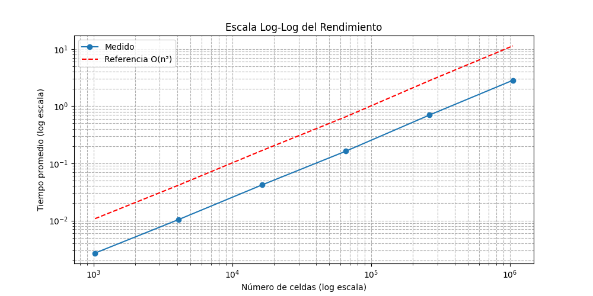

# Informe de Rendimiento – Juego de la Vida de Conway

Estudiante: Adrian Carballo Flores  
Curso: Computación Paralela y Distribuida  
Profesor: Johansell Villalobos Cubillo  

---

## Objetivo del análisis (Parte 4)

En esta última parte del trabajo, realicé un análisis detallado del rendimiento del Juego de la Vida de Conway implementado previamente. Utilicé herramientas de perfilado profesional para identificar las funciones más costosas y a partir de eso, interpreté los cuellos de botella que impactan el rendimiento general del programa.

Además, ejecuté pruebas de escalabilidad fuerte y débil para evaluar el comportamiento del sistema cuando se modifica la cantidad de procesos y el tamaño del problema. El objetivo fue obtener evidencia empírica para entender el impacto del paralelismo y la estructura del código en el rendimiento de la simulación.

---

## Herramientas utilizadas

- Lenguaje: Python 3.12
- Visualización: matplotlib
- Animaciones: matplotlib.animation y pillow
- Paralelismo: multiprocessing
- Perfilado:
  - cProfile: para análisis por función
  - line_profiler: para análisis línea por línea con decoradores @profile

---

## Organización del proyecto

El código fue estructurado para guardar automáticamente todos los resultados en carpetas organizadas:

```
/Tarea2
├── graficas/          # Gráficas PNG del análisis de rendimiento y escalabilidad
├── animaciones/       # Animación en formato .gif
├── perfilado/         # Archivo con resultados del perfilado cProfile
├── Performance.md     # Este informe
├── README.md          # Documentación del proyecto
└── Tarea2.py          # Código fuente principal
```

---

## Visualización del patrón Glider

Se generó una animación del patrón Glider en una grilla de 32x32 durante 100 pasos utilizando `matplotlib.animation` y `pillow`. La animación fue exportada como un archivo `.gif`.

**Archivo generado:**  


---

## Medición de rendimiento (secuencial)

Ejecuté simulaciones de 5 pasos en diferentes tamaños de grilla, midiendo el tiempo total y el promedio por paso. Estos datos permiten visualizar cómo crece el tiempo de ejecución en función del número de celdas.

### Resultados empíricos

| Tamaño (n x n) | Celdas totales | Tiempo total (s) | Tiempo por paso (s) |
|----------------|----------------|------------------|----------------------|
| 32x32          | 1,024          | 0.0135           | 0.0027               |
| 64x64          | 4,096          | 0.0520           | 0.0104               |
| 128x128        | 16,384         | 0.2103           | 0.0421               |
| 256x256        | 65,536         | 0.8158           | 0.1632               |
| 512x512        | 262,144        | 3.4922           | 0.6984               |
| 1024x1024      | 1,048,576      | 14.2073          | 2.8415               |

### Gráficas generadas

Gráfica en escala lineal:  


Gráfica en escala log-log:  


---

## Análisis con cProfile

Utilicé `cProfile` para analizar el tiempo total de ejecución por función. Realicé una simulación de 100 pasos sobre una grilla de 512x512.

**Archivo generado:**  
`perfilado/perfil_cprofile.txt`

### Resultados destacados

| Función              | Llamadas    | Tiempo acumulado |
|----------------------|-------------|------------------|
| `step()`             | 100         | 84.84 s          |
| `count_neighbors()`  | 26,214,400  | 73.45 s          |

Como se puede observar, la función `count_neighbors()` representa por sí sola más del 85% del tiempo de ejecución total. Esta función es llamada para cada celda en cada paso, por lo que optimizarla es clave para mejorar el rendimiento global.

---

## Análisis con line_profiler

Decoré las funciones `step()` y `count_neighbors()` con `@profile` y utilicé `kernprof` para obtener un análisis línea por línea.

Este análisis confirmó que las líneas más costosas están en los bucles que recorren la grilla y en el conteo de vecinos. La función `count_neighbors()` es la más intensiva en tiempo.

---

## Escalamiento fuerte

Probé el rendimiento manteniendo constante el tamaño de la grilla (512x512) mientras aumentaba la cantidad de procesos paralelos: 1, 2, 4 y 8.

### Resultados

| Procesos | Tiempo (s) | Speedup | Eficiencia |
|----------|------------|---------|------------|
| 1        | 29.04      | 1.00    | 1.00       |
| 2        | 24.88      | 1.17    | 0.58       |
| 4        | 24.54      | 1.18    | 0.30       |
| 8        | 24.55      | 1.18    | 0.15       |

### Gráfica


### Interpretación

La mejora es evidente al pasar de 1 a 2 procesos, pero luego se estabiliza. Esto indica que hay un límite práctico debido a la sobrecarga de sincronización entre procesos y el acceso compartido a memoria.

---

## Escalamiento débil

Mantuve constante la carga por proceso (10,000 celdas) y aumenté proporcionalmente el número de procesos y el tamaño del tablero.

### Resultados

| Procesos | Tamaño de grilla | Tiempo total (s) |
|----------|------------------|------------------|
| 1        | 100x100          | 0.996            |
| 2        | 142x142          | 1.850            |
| 4        | 200x200          | 3.449            |
| 8        | 282x282          | 7.227            |

### Gráfica


### Interpretación

El tiempo de ejecución crece con el número de procesos, a pesar de que la carga por proceso se mantiene. Esto se debe a que el trabajo total aumenta y los costos de sincronización no escalan de manera eficiente en este enfoque.

---

## Conclusiones

- La versión secuencial tiene una complejidad esperada de O(n²), confirmada por las pruebas empíricas.
- `count_neighbors()` es el principal cuello de botella. Esta función consume la mayoría del tiempo total de ejecución.
- La versión paralela con `multiprocessing` mejora el rendimiento ligeramente, pero sufre penalizaciones por sincronización y uso de memoria compartida.
- El escalamiento fuerte tiene un límite práctico con más de 2 procesos.
- El escalamiento débil demuestra que el tiempo total sigue aumentando, aunque la carga por proceso se mantenga constante.
- Como mejoras futuras consideraría implementar optimizaciones con `Numba` o `Cython`, o usar una estrategia de paralelismo distribuido como `MPI`.

---

## Archivos generados

```
/Tarea2
├── graficas/
│   ├── rendimiento_lineal.png
│   ├── rendimiento_loglog.png
│   ├── escalamiento_fuerte.png
│   └── escalamiento_debil.png
├── animaciones/
│   └── glider_32x32.gif
├── perfilado/
│   └── perfil_cprofile.txt
├── Performance.md
├── README.md
└── Tarea2.py
```

---
